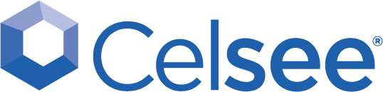

### The menu to the left has links to all of the sections and talks we will be covering this week. You can use the Menu icon in the upper left to toggle the menu.

Bioinformatics: scRNA-Seq Workshop @ UC San Franscisco
Nov. 25, 2019, 9 a.m. - Nov. 27, 2019, 4:30 p.m.  
Organizer - UCD Bioinformatics Core  
Contact - UC Davis Bioinformatics Core, training.bioinformatics@ucdavis.edu

This workshop will cover experimental design, data generation, and analysis of single cell RNA sequencing data (primarily generated using the 10x genomics platform) on the command line and within the R statistical programming language. Participants will explore software and protocols, create and modify workflows, and diagnose/treat problematic data utilizing high performance computing services. Exercises will be performed on the command line and within R with a provided dataset. The primary packages used for analysis will be 10x software cellranger (for sequence reads to counts) and R packages (ex. Seurat) for downstream analysis.

A preliminary agenda for the week includes:

* Monday	Introduction to the command line, cluster resources, and data reduction of single cell RNA sequencing data.
* Tuesday	R analysis of scRNAseq
* Wednesday R analysis of scRNAseq

Lecture topics throughout the week will include:

* What is Bioinformatics? Hardware and software considerations.
* Single Cell Library Prep and Sequencing technologies
* Experimental design and cost estimation

### Industry Sponsors

|:------|:------|------|  
| Monday |  |  |  
| |  |  |  
| Tuesday |  |    |  
| |  |  |  
| Wednesday |  |    |  

### FAQ

**Who should attend?** … Prior course participants have included faculty, post docs, grad students, staff, and industry researchers.

**What are the prerequisites?** … There are no prerequisites other than familiarity with general biological concepts and an enthusiasm for learning bioinformatics data analysis. Some familiarity with the command-line and R is desirable.  However, we will dedicate some limited time to bringing everyone up-to-speed to be able to run the commands needed during this workshop.

**What do I need to bring?** … You will need to bring your own laptop to use, have a recent version of Java installed, and an application that will allow you to ssh into a server (e.g. Bash for windows 10, or terminal for Apple) as well as the ability to connect to the internet via wifi. Computational exercises will be performed on a remote server. We can help with setup early on in the workshop. If your department does not allow you to install software on the laptop you’ll be bringing, please contact us ahead of time.

**Can I bring my own data?** … We will provide experimental datasets for use during the workshop, as this helps to keep the workshop moving. There will be time, however, to discuss your own datasets and how you might work with them outside of the workshop.

**Where is the workshop?** … It will be held in Genentech Hall at UCSF and will run from 9:30am to 4:30pm on the dates indicated. The room number will be provided at a later date.

**How do I apply?** … All registration is “first-come, first-served”. There is no application process.  So, sign up as soon as possible to ensure your place in the workshop.

**Where can I find more information, including your policies?**  ... Go to our website (bioinformatics.ucdavis.edu/training/) and check out our [FAQ](http://bioinformatics.ucdavis.edu/training/faq/) and [Policies](http://bioinformatics.ucdavis.edu/training/policies/).

### Questions

If you have any questions, please don’t hesitate to contact us at training.bioinformatics@ucdavis.edu

### Register

https://registration.genomecenter.ucdavis.edu/events/scRNASeq_Workshop_UCSF_11_2019/

**Registration is closed for this event**
